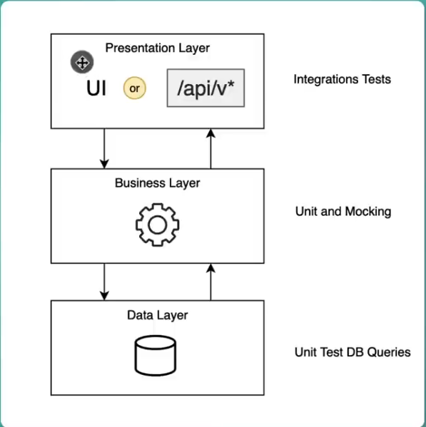

Try-Catch-Finally

~~~java
package theory;

import java.io.BufferedReader;
import java.io.IOException;
import java.io.InputStreamReader;
import java.util.logging.Logger;

/**
 * @author Heshan Karunaratne
 */
public class TryWithResources {
    private static final Logger LOGGER = Logger.getLogger(TryWithResources.class.getName());

    public static void main(String[] args) throws Exception {
        getOldWay();
        getNewWay();
    }

    private static void getOldWay() throws IOException {
        BufferedReader br = null;
        try {
            br = new BufferedReader(new InputStreamReader(System.in));
            String str = br.readLine();
            LOGGER.info(str);
        } catch (Exception e) {
            LOGGER.info(e.getMessage());
        } finally {
            br.close();
        }
    }

    private static void getNewWay() throws IOException {
        try (BufferedReader br = new BufferedReader(new InputStreamReader(System.in))) {
            String str = br.readLine();
            LOGGER.info(str);
        }
    }
}
~~~

# N-Tier Architecture

Above is a 3-Layer diagram

- Deleting an item while looping: Use an iterator
~~~java
package theory;

import java.util.ArrayList;
import java.util.Arrays;
import java.util.Iterator;
import java.util.List;

public class LoopingIterator {
    public static void main(String[] args) {
        List<String> words = new ArrayList<>(Arrays.asList("a", "b", "c"));
        Iterator<String> iterator = words.iterator();
        //Step1
        while (iterator.hasNext()) {
            String word = iterator.next();
            if (word.equals("a")) {
                iterator.remove();
            }
        }
        //Step2
        words.removeIf(word -> word.equals("a"));
    }
}
~~~

- MavenInvoker.java

~~~java
import com.mitrai.tallelf.constants.AppConstants;
import org.apache.log4j.Logger;
import org.apache.maven.shared.invoker.*;

import java.io.File;
import java.util.Collections;

/**
 * @author Heshan Karunaratne
 */
public class MavenInvoker {

    private final String directory;
    private final String goals;
    private static final Logger LOGGER = Logger.getLogger(MavenInvoker.class);

    public MavenInvoker(String directory, String goals) {
        this.directory = directory;
        this.goals = goals;
    }

    public void invokeMavenCommands() {

        InvocationRequest request = new DefaultInvocationRequest();
        request.setPomFile(new File(directory, AppConstants.POM_XML_FILE));
        request.setGoals(Collections.singletonList(goals));

        DefaultInvoker invoker = new DefaultInvoker();
        invoker.setMavenHome(new File(AppConstants.MAVEN_DIR));

        try {

            InvocationResult result = invoker.execute(request);
            if (result.getExitCode() == 0)
                LOGGER.info("MAVEN_COMMAND_EXECUTION_SUCCESS: " + goals);

            else
                LOGGER.info("MAVEN_COMMAND_EXECUTION_FAILED_WITH_EXIT_CODE: " + result.getExitCode());

        } catch (MavenInvocationException e) {
            LOGGER.error("ERROR_EXECUTING_MAVEN_COMMAND: " + e.getMessage());
        }
    }
}
~~~